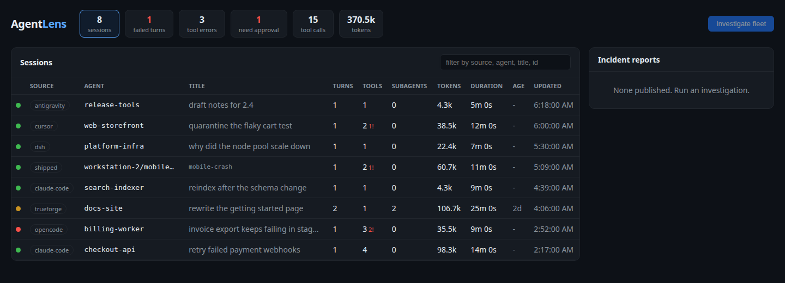
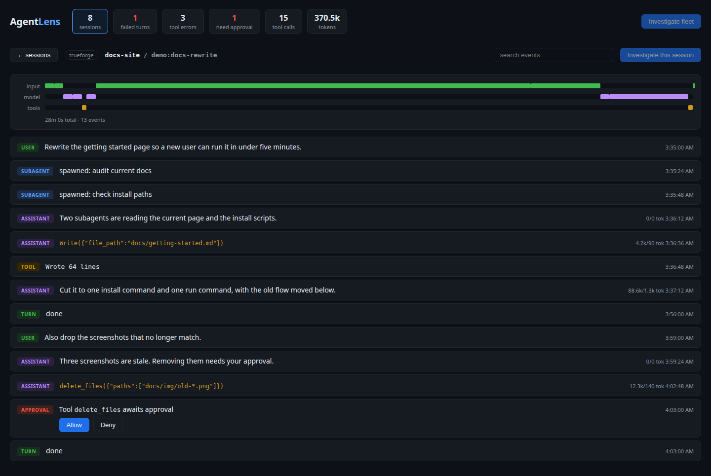

# AgentLens

Observability for TrueForge agents: a trace viewer for every session your agents
run, and an investigator agent that diagnoses the bad ones.

Built for the Agent Harness Hackathon (WeMakeDevs + TrueFoundry, Aug 2026).

## What it does

- Collects sessions, turns, and events from a TrueForge server into SQLite.
- Dashboard with a fleet overview and a per-session trace view: timeline of
  input/model/tool activity plus a turn-by-turn transcript with durations.
- Investigator agent (a TrueForge agent) that triages failed or slow sessions
  using AgentLens MCP tools, parallel subagents, sandboxed analysis, and an
  approval gate before publishing its incident report.

## Layout

- `packages/server` — collector, REST/SSE API, MCP server
- `packages/web` — dashboard (Vite + React)
- `agents/` — TrueForge agent specs

## Running

Needs Node 22+. The local TrueForge sandbox additionally needs `bwrap`, `socat`,
and `rg` on the host.

1. `npx @truefoundry/trueforge` (TrueForge at http://localhost:8790)
2. Add a model provider (TrueForge UI settings, or the API).
3. `npm install`
4. `npm run dev -w packages/server` (API :8788, MCP server :8791)
5. `npm run dev -w packages/web` (dashboard at http://localhost:5173)
6. `SANDBOX=1 npm run seed -w packages/server` registers the AgentLens MCP
   server in TrueForge, creates the investigator plus two demo agents (one wired
   to a dead MCP server so failures exist), and generates demo traffic.

Click "Investigate fleet" in the dashboard. The investigator finds the failing
sessions, fans out subagents, drafts an incident report, and pauses on the
approval gate; Allow publishes the report to the dashboard.

## Harness feature map

How AgentLens uses TrueForge capabilities (filled in as built):

| TrueForge capability | Where used |
|---|---|
| MCP tools | Investigator agent calls the AgentLens MCP server (list_problem_sessions, get_trace, get_metrics) |
| Subagents | Investigator fans out one subagent per suspect session |
| Sandboxed code execution | Trace analysis scripts run in the sandbox |
| Human approvals | Approval gate before the investigator publishes an incident report |
| Persistent sessions | Collector ingests session/turn/event history via the SDK; dashboard renders it |

## Tools used

- TrueForge (`@truefoundry/trueforge`, `@truefoundry/trueforge-sdk`) - agent harness
- Node 22+/TypeScript, Hono, better-sqlite3, Vite + React

All changes land through pull requests; no direct pushes to main.

## Related work

TrueForge's bundled UI is a per-session chat interface; it has no cross-session
view, metrics, or timelines. Existing agent-observability tools (OpenTelemetry
wrappers, CLI analyzers) are harness-agnostic and miss what the harness knows:
subagent threads, approval gates, turn states. AgentLens is harness-native.

Future work: an OTLP exporter on the collector, translating the mirrored event
log into OpenTelemetry GenAI spans so traces land in Tempo/Jaeger alongside
infra traces. TrueForge emits no telemetry itself, so the exporter belongs here.

The store and UI are harness-neutral; TrueForge is the first adapter, and an
OTLP receiver (ingesting OTel GenAI spans from Claude Code, opencode, and
others) is the second.

## Links

- Build story: https://gengwg.medium.com/building-agentlens-what-trueforge-doesnt-tell-you-until-you-build-on-it-4173e6f7d6ce
- Raw build log: [BUILDLOG.md](BUILDLOG.md)
