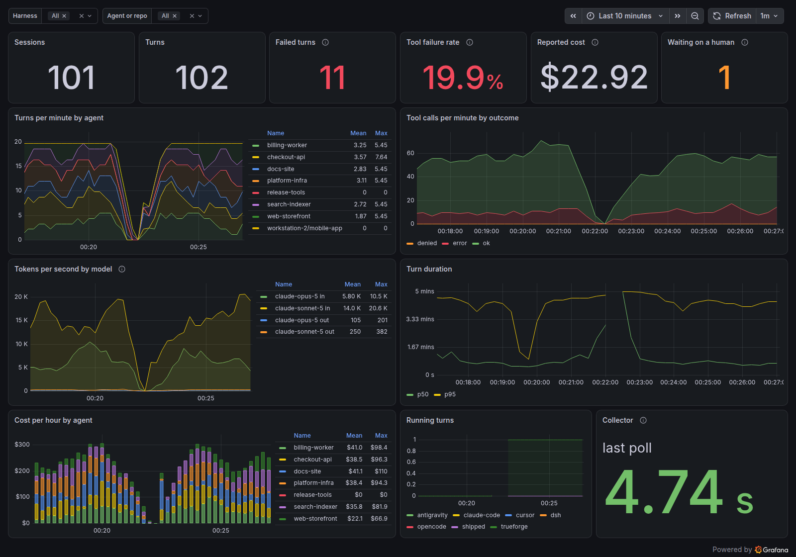

# AgentLens

Local observability for coding-agent harnesses: a fleet view and trace viewer
for every Claude Code, OpenCode, dsh, Roo Code, Cursor Agent, Antigravity CLI,
and TrueForge session on your machine (plus Codex CLI, Gemini CLI, and Cline,
experimental), and an investigator agent that diagnoses the bad ones.

Started at the Agent Harness Hackathon (WeMakeDevs + TrueFoundry, Aug 2026).


Both screenshots come from the invented fleet that `npm run demo` writes, so
they show the layout without anyone's transcripts.

## What it does

- Collects sessions, turns, and events into SQLite from local harness logs
  (Claude Code, OpenCode, dsh, and others) and from a TrueForge server. Any
  other harness can post the same JSON to the ingest API.
- Dashboard with a fleet overview and a per-session trace view: timeline of
  input/model/tool activity plus a turn-by-turn transcript with durations.
  "Failed turns" counts sessions whose turn ended in an error; "tool errors"
  counts sessions where a tool call failed. A tool the user declined is a
  choice, not a failure, and counts as neither.
- Investigator agent (a TrueForge agent) that triages failed or slow sessions
  using AgentLens MCP tools, parallel subagents, sandboxed analysis, and an
  approval gate before publishing its incident report.

## Layout

- `packages/server` — collector with one adapter per harness
  (`src/sources/`), REST/SSE API, MCP server
- `packages/web` — dashboard (Vite + React)

Agent specs (investigator plus two demo agents) are defined in
`packages/server/src/seed.ts` and registered in TrueForge via its API.

## Running

Needs Node 22+.

```
npx @gengwg/agentlens
```

Open http://localhost:8788. Your existing Claude Code, OpenCode, dsh, and other
sessions show up within seconds, and running ones update live. Everything stays
on your machine: the server binds to loopback and reads the logs in place.

The package is [@gengwg/agentlens](https://www.npmjs.com/package/@gengwg/agentlens).

No harness logs to look at yet? `AGENTLENS_DB=demo.db npm run demo -w
packages/server` writes an invented fleet (eight sessions across six sources,
with a failure, a pending approval and a running turn) into a throwaway
database; start the server with the same `AGENTLENS_DB` to browse it.
It pulls in `better-sqlite3`, which downloads a prebuilt native binary (or
compiles one) during install.

To hack on it instead, clone and run the API and dashboard separately:

```
git clone https://github.com/gengwg/agentlens && cd agentlens
npm install
npm run dev -w packages/server    # API :8788, MCP :8791
npm run dev -w packages/web       # dashboard http://localhost:5173
```

`npm start` from the clone builds the dashboard and serves everything on :8788,
the same as the published package.

## Sources

Sources are auto-detected from the default locations below; TrueForge is always
on (idle until the server is reachable). Each adapter translates its harness's
records into one event vocabulary, so the store, the MCP tools, and the trace
view are shared. `AGENTLENS_SOURCES` pins the list (comma-separated names).

| Source | Status | Default location (override) |
|---|---|---|
| `claude-code` | tested | `~/.claude/projects` (`CLAUDE_PROJECTS_DIR`) |
| `opencode` | tested | `~/.local/share/opencode/opencode.db` (`OPENCODE_DB`) |
| `dsh` | tested | `~/.dsh` (`DSH_HOME`) |
| `trueforge` | tested | `http://localhost:8790` (`TRUEFORGE_URL`) |
| `cursor` | tested on small samples | `~/.cursor` (`CURSOR_HOME`), Cursor Agent CLI transcripts |
| `antigravity` | tested on small samples | `~/.gemini/antigravity-cli` (`ANTIGRAVITY_HOME`) |
| `roo-code` | tested | VS Code `globalStorage` task dirs (`ROO_TASKS_DIR`) |
| `codex` | experimental | `~/.codex` (`CODEX_HOME`) |
| `gemini` | partly verified | `~/.gemini` (`GEMINI_HOME`); Gemini CLI is enterprise-only since June 2026 |
| `cline` | experimental | VS Code `globalStorage` task dirs, same layout as Roo Code |

Experimental adapters are written from the public log formats and have
synthetic tests only; open an issue with a sample session if one misreads yours.
Roo Code is checked against real tasks: it uses the native tool protocol, where
`attempt_completion` ends a turn and the workspace comes from `history_item.json`.
Cline shares the layout but no sample was available.
The Gemini adapter reads the current JSONL chat log and the older JSON
document; its prompt handling is verified against a real run, but Gemini CLI
refuses individual accounts, so its reply, tool, and token fields are not.
Cursor Agent transcripts record no per-message timestamps, tool results, or
token usage, so event times are interpolated between the chat's start and end.
Antigravity CLI records no token usage, and only conversations with a row in
`conversation_summaries.db` know their workspace; the rest, print-mode runs among
them, group under the source name. The Cursor IDE's own chats (not the CLI)
are not read.
Other variables: `AGENTLENS_DB` (`agentlens.db`), `PORT` (`8788`), `MCP_PORT`
(`8791`), `AGENTLENS_HOST` (`127.0.0.1`, see Shared server below),
`AGENTLENS_CORS_ORIGIN` (`http://localhost:5173`, only needed if you serve the
dashboard from somewhere other than the Vite dev server).

A session records the git branch it started on, read from `.git/HEAD` in the
harness's working directory - no subprocess, and it works when git is absent.
It shows beside the agent name and the filter box matches it, so "what ran on
`release/2.4`" is a question the table can answer. TrueForge sessions have no
working directory and so no branch. It is recorded the first time AgentLens
sees the session with a working directory and never overwritten, so a session
that outlives a checkout keeps the branch it was first seen on; the logs do not
record when a checkout happened, so anything else would be invention. It is deliberately **not** a `/metrics` label: branches are unbounded
over time and would multiply every series by them.

Secrets are masked before an event is stored. A session records whatever
crossed it - a key pasted into a prompt, a `printenv`, a `.env` read back by a
tool - and `agentlens.db` is a file with no authentication in front of it, so a
token in a transcript is a token at rest. The pattern table is the tier-1 set
from Grafana's [agento11y](https://github.com/grafana/agento11y) (Apache-2.0,
patterns from Gitleaks; see [NOTICE](NOTICE)): cloud and provider API keys,
GitHub and Slack tokens, private-key blocks, connection strings with
credentials, bearer tokens. Their tier-2 key/value guesses are deliberately
left out, since `DB_PASSWORD=hunter2` in a transcript is often the thing you
opened the transcript to find. `AGENTLENS_REDACT=0` turns masking off. Masking guards writes, so anything
stored before it existed stays as it was; `agentlens redact-history` reports
what is left and `--apply` masks it, copying the database first. It is safe to
run repeatedly, since masking an already-masked row changes nothing.

Claude Code and dsh transcripts are tailed with per-file cursors (subagent
transcripts become threads); OpenCode is polled read-only from its SQLite
database (child sessions become threads); Gemini and Roo files are re-read when
they change. A turn left running by a killed process is closed after 30 minutes.

### Bring your own harness

Anything that can make an HTTP request can ship sessions in:

```
curl -X POST localhost:8788/api/ingest -H 'content-type: application/json' -d '{
  "source": "grok",
  "sessions": [{"id": "s1", "agent_name": "my-project", "title": "fix login", "created_at": "2026-09-06T10:00:00Z"}],
  "turns": [{"id": "s1:t1", "session_id": "s1", "created_at": "2026-09-06T10:00:00Z", "status": "done", "completed_at": "2026-09-06T10:00:42Z"}],
  "events": [
    {"id": "s1:e1", "session_id": "s1", "turn_id": "s1:t1", "type": "turn.created", "created_at": "2026-09-06T10:00:00Z",
     "raw": {"input": [{"type": "user.message", "content": "fix login"}]}},
    {"id": "s1:e2", "session_id": "s1", "turn_id": "s1:t1", "type": "model.message", "created_at": "2026-09-06T10:00:30Z",
     "raw": {"content": "Patched.", "toolCalls": [{"id": "c1", "function": {"name": "bash", "arguments": "{}"}}],
             "usage": {"inputTokens": 1200, "outputTokens": 80}}},
    {"id": "s1:e3", "session_id": "s1", "turn_id": "s1:t1", "type": "tool.response", "created_at": "2026-09-06T10:00:40Z",
     "raw": {"content": "ok", "toolCallId": "c1", "error": false}}
  ]
}'
```

Ids are yours and must be unique across sessions; resending is idempotent.
`source` is 1-32 characters from letters, digits, `-`, `_`, `.`.
Turn `status` is `running`, `done`, `error`, or `cancelled`. Event types the
dashboard renders: `turn.created`, `model.message`, `tool.response`,
`thread.created` (`raw.title`, with `thread_id` on the thread's events), and
`turn.done` (`raw.state.status`).

## Shared server (experimental)

One machine can run AgentLens for a team while transcripts stay on the laptops
that produced them. Each machine ships **metadata only**: agent, turn
boundaries and status, tool names, token counts, error flags. Prompts, model
replies, tool output, tool arguments, error messages and titles are dropped by
the sender, before anything crosses the network.

On the server, listening on a private address (a tailnet, not the internet):

```
AGENTLENS_HOST=100.x.y.z npx @gengwg/agentlens
```

On each machine, alongside the local AgentLens:

```
agentlens ship --to http://100.x.y.z:8788
```

The shipper reads the local database that your own AgentLens fills, so keep
that running (or point `AGENTLENS_DB` at its file). It sends every 60 seconds
(`--interval`, or `--once` for a single pass), remembers what it already sent,
and namespaces ids by hostname so two machines cannot collide. `--source`
names the badge on the shared fleet, `shipped` by default.

On the shared view the Agent column reads `machine/project` and the Title
column shows a session id, because titles are first-prompt text and stay
local; `AGENTLENS_SHIP_TITLES=1` opts in. Branch names do travel, so the fleet
can answer what ran on `release/2.4`; `AGENTLENS_SHIP_BRANCH=0` holds them back
if a branch name says more about your work than you want shared. A shared trace has the full shape,
turns, tool calls by name, token counts and timings, with empty message bodies.

There is no authentication: anyone who can reach the port sees every shipped
session and can post to it. Keep it on a private network, and remember the
server also ingests its own local sessions unless you set `AGENTLENS_SOURCES`.

## Send it to Grafana

AgentLens collects; Grafana draws. `GET /metrics` exposes the fleet in
Prometheus format, so the charting, history and alerting belong to the tool
that is good at them.

```yaml
scrape_configs:
  - job_name: agentlens
    static_configs:
      - targets: ["localhost:8788"]
```

Then import [`docs/grafana-dashboard.json`](docs/grafana-dashboard.json) and
pick your Prometheus. It draws turns and tool outcomes over time, tool failure
rate, tokens by model, reported cost by agent, turn-duration percentiles,
running turns, sessions waiting on an approval, and whether each source is
still readable.



That capture is the demo fleet under synthetic load, so the rates are invented;
the dip is the collector restarting.

Series are grouped by `source`, `agent` and `model` only, never by session, so
cardinality stays bounded. Counters are recomputed from SQLite on each scrape
rather than counted in memory, which means a deleted database reads as a
counter reset.

`agentlens_cost_usd_total` carries a `basis` label. `reported` is what the
harness charged (OpenCode and Roo Code do; the rest report nothing).
`estimated` is token counts priced from [models.dev](https://models.dev), the
same database OpenCode prices itself from. A session is never both. Only events
that record cache tokens separately can be estimated, since before that split
cache reads were folded into input and pricing them at the input rate overstates
a bill roughly tenfold, so history from before v0.8.1 stays unpriced.

Prices are fetched once a week and cached in `~/.cache/agentlens/prices.json`.
That is the one request AgentLens makes to the internet, it sends nothing, and
`AGENTLENS_PRICES=off` stops it. `AGENTLENS_PRICES=/path/to.json` uses your own
table instead, as `{"model": {"input": 5, "output": 25, "cache_read": 0.5,
"cache_write": 6.25}}` in dollars per million tokens. With no prices and no
network, reported cost still works and nothing else changes.

`/metrics` carries agent and repository names, and no more: no prompts, no
titles, no tool output. It has no authentication, like the rest of the API, so
keep the port private.

If you would rather send sessions somewhere else entirely, look at Grafana's
[agento11y](https://github.com/grafana/agento11y) first. Its plugins forward
Claude Code, Cursor, OpenCode, Codex, Copilot CLI, Pi and Vibe to Grafana Cloud
Agent Observability, `agento11y history import` backfills sessions written
before it was installed, and `--local` keeps everything on the machine. It is a
maintained product with evaluations and guards, which this is not.

What is left here that it does not do: dsh, Roo Code, Antigravity CLI and
TrueForge; the trace view with its approval gate; the investigator agent; and a
server you host yourself, open source end to end.

## Harness feature map

How AgentLens uses TrueForge capabilities (filled in as built):

| TrueForge capability | Where used |
|---|---|
| MCP tools | Investigator agent calls the AgentLens MCP server (list_problem_sessions, get_trace, get_metrics) |
| Subagents | Investigator fans out one subagent per suspect session |
| Sandboxed code execution | Trace analysis scripts run in the sandbox |
| Human approvals | Approval gate before the investigator publishes an incident report |
| Persistent sessions | Collector ingests session/turn/event history via the SDK; dashboard renders it |

## Tools used

- TrueForge (`@truefoundry/trueforge`, `@truefoundry/trueforge-sdk`) - agent harness
- Node 22+/TypeScript, Hono, better-sqlite3, Vite + React

All changes land through pull requests; no direct pushes to main.

## Related work

TrueForge's bundled UI is a per-session chat interface; it has no cross-session
view, metrics, or timelines. Existing agent-observability tools (OpenTelemetry
wrappers, CLI analyzers) are harness-agnostic and miss what the harness knows:
subagent threads, approval gates, turn states. AgentLens is harness-native.

Future work: an OTLP exporter on the collector, translating the mirrored event
log into OpenTelemetry GenAI spans so traces land in Tempo/Jaeger alongside
infra traces. TrueForge emits no telemetry itself, so the exporter belongs here.

The store and UI are harness-neutral. Adapters exist for TrueForge, Claude Code,
OpenCode, dsh, Codex CLI, Gemini CLI, Roo Code, and Cline; each new harness is
one file under `packages/server/src/sources/`, or a client of the ingest API.
A shared company server, with per-machine shippers pushing metadata to one
AgentLens, is built: see "Shared server" above.

## Optional: investigator agent

The investigator is a TrueForge agent that triages failed or slow sessions from
any harness using the AgentLens MCP tools, parallel subagents, sandboxed
analysis, and an approval gate before publishing its incident report. The
sandbox needs `bwrap`, `socat`, and `rg` on the host.

1. `npx @truefoundry/trueforge` (TrueForge at http://localhost:8790)
2. Add a model provider (TrueForge UI settings, or the API).
3. `SANDBOX=1 npm run seed -w packages/server` registers the AgentLens MCP
   server in TrueForge, creates the investigator plus two demo agents (one wired
   to a dead MCP server so failures exist), and generates demo traffic.

Click "Investigate fleet" in the dashboard. The investigator finds the failing
sessions, fans out subagents, drafts an incident report, and pauses on the
approval gate; Allow publishes the report to the dashboard. Trace excerpts are
sent to the model provider configured in TrueForge.

## Links

- Build story: https://gengwg.medium.com/building-agentlens-what-trueforge-doesnt-tell-you-until-you-build-on-it-4173e6f7d6ce
- Raw build log: [BUILDLOG.md](BUILDLOG.md)
